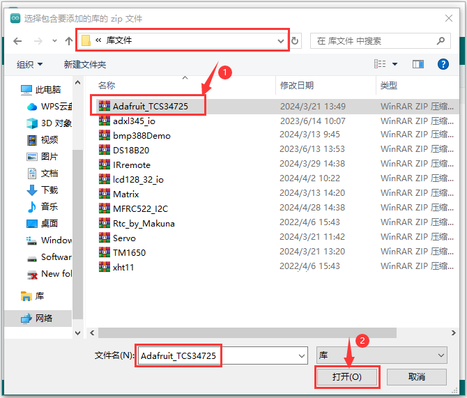
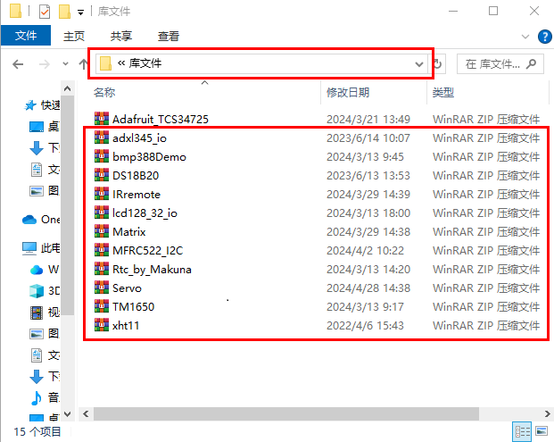

# 添加Arduino库文件

打开Arduino IDE，点击“**<u>项目</u>**”，选择“**<u>导入库</u>**”，最后选择“**<u>添加.ZIP库...</u>**”。

根据库文件的路径打开本项目教程所用的库文件夹，选中库文件夹中 .zip格式的库文件压缩包（以“**Adafruit_TCS34725**”库文件压缩包为例），然后单击“**打开**”，这样Adafruit_TCS34725库文件成功加入。

然后参照上述方法依次将剩余的库文件（红色框中的）全部添加完。

